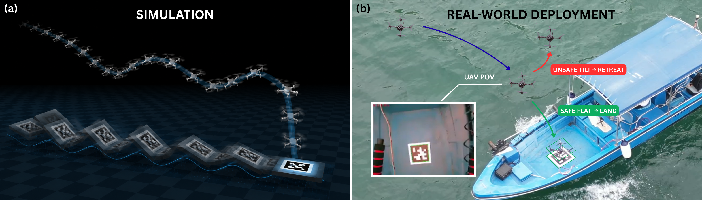

<div align="center">

## 🌊 WaveLander： A Generalizable Hierarchical Control Framework for UAV Landing on Wave-Disturbed Platforms via Reinforcement Learning

</div>

<p align="center">
  
  
  
  
</p>

<p align="center">
  <strong>Chun-Kit Li</strong>,
  <strong>Iok Long Sit</strong>,
  <strong>Ming Fung Siu</strong>,
  <strong>Ka Yu Kui</strong>,
  <strong>Hin Wang Lin</strong>,
  <strong>Pengyu Wang</strong>,
  <strong>Ling Shi</strong>
</p>

<p align="center">
  Cheng Kar-Shun Robotics Institute<br>
  The Hong Kong University of Science and Technology

</p>

<p align="center">
  
</p>

---

> <strong>WaveLander</strong> is a reinforcement-learning-based hierarchical control framework for UAV landing on wave-disturbed platforms.
> It decouples high-level vertical landing decision-making from low-level flight stabilization, enabling timing-aware descent, holding, and retreat behaviors under dynamic platform motion.

## Status

🚧 **Code release coming soon.**

This paper has been submitted to **ICARCV 2026** and is currently under review.  
The repository is being prepared for public release.


## Overview

WaveLander is a hierarchical learning-based control framework for UAV landing on wave-disturbed marine platforms. Instead of learning low-level motor commands, WaveLander uses reinforcement learning for high-level vertical landing decisions, while a conventional flight controller handles attitude stabilization, lateral tracking, and velocity tracking.

The learned policy takes a compact platform-relative observation, including relative height, vertical velocity, platform tilt, and tilt-rate information, and outputs a scalar vertical velocity reference. This formulation reduces dynamic platform landing to a low-dimensional timing-aware control problem, where the UAV learns when to descend, hold, or retreat under time-varying platform motion.

WaveLander is evaluated through randomized MuJoCo simulation, Isaac Sim software-in-the-loop transfer, and a representative real-world deployment test. The results show that the learned vertical policy improves touchdown timing compared with fixed-descent behavior and provides a compact interface for deployment-oriented UAV landing on moving marine platforms.

## Paper

The manuscript is currently under review.  
Paper link and citation information will be updated after publication.

## Video

Supplementary experiment videos will be added soon.

## Citation

Citation information will be updated after the paper becomes available.

```bibtex
@misc{li2026wavelander,
  title  = {{WaveLander}: A Generalizable Hierarchical Control Framework for {UAV} Landing on Wave-Disturbed Platforms via Reinforcement Learning},
  author = {Li, Chun-Kit and Sit, Iok Long and Siu, Ming Fung and Kui, Ka Yu and Lin, Hin Wang and Wang, Pengyu and Shi, Ling},
  year   = {2026},
  note   = {Submitted to ICARCV 2026, under review}
}
```

## Acknowledgements

We thank **Prof. Ling Shi** for his guidance and support throughout this research project. We also thank **HKUST** and the **Cheng Kar-Shun Robotics Institute** for their support. We are grateful to our colleagues and close collaborators at the **3121B Multi-Agent Systems Laboratory**, including **Fan Zhang**, **Yim Ying Hing**, **Shan Wen**, and **Xiawei Du**, as well as **Shiliang Zhao** from **Zhengzhou University**, for their helpful support during the preparation of this work.


## License

The code will be released under the MIT License upon public release.

```
```
